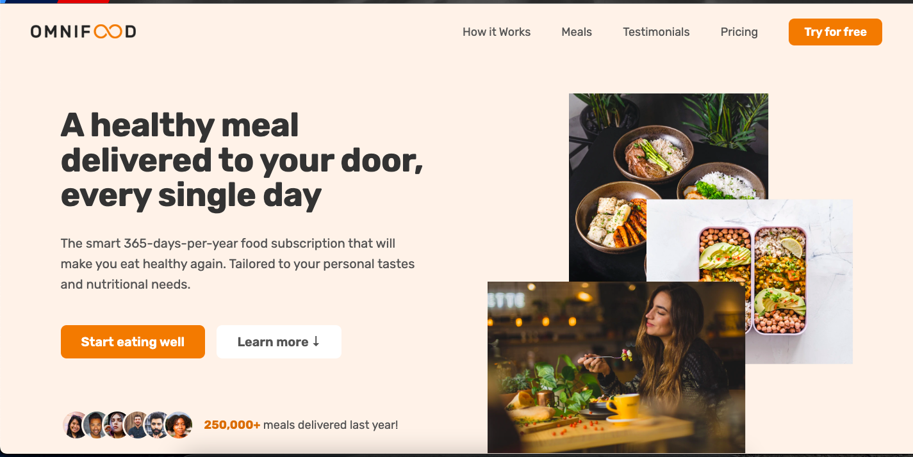
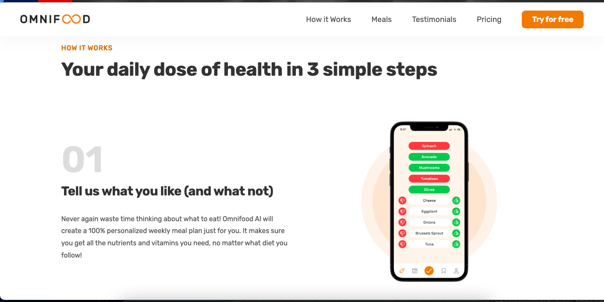
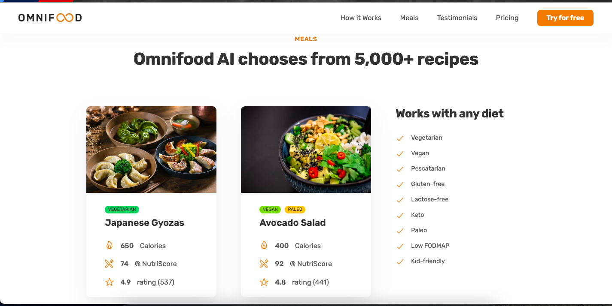
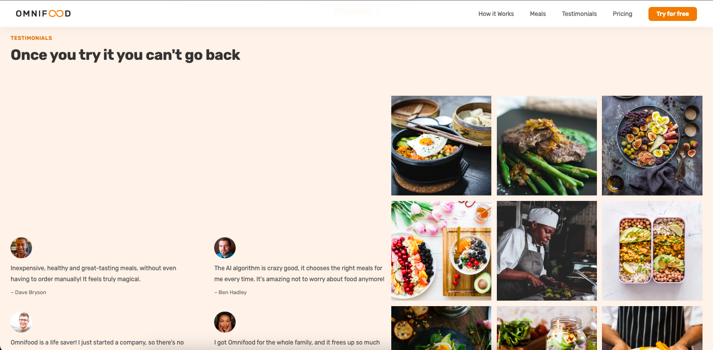
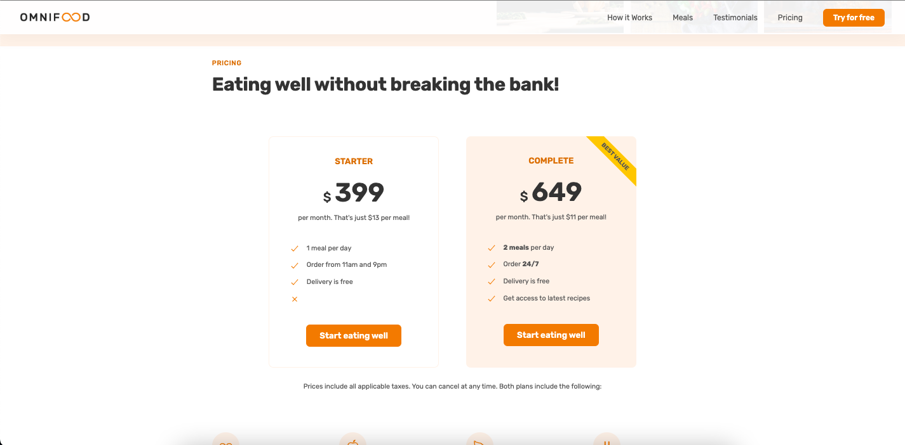
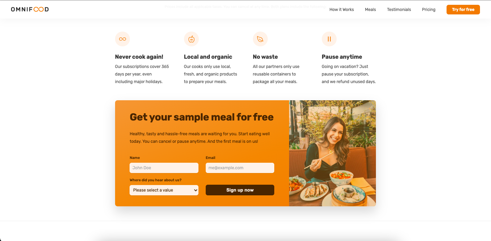

Here’s a sample README file content for a food website homepage project using HTML and CSS:

---

# Omnifood - Homepage

## Project Description

**Omnifood** is a simple, responsive, and visually appealing homepage for a food website. This project showcases a restaurant's offerings, highlights popular dishes, and includes essential sections like an "Testimonials," "Menu," and "Pricing." and Registration. The website is built using **HTML** and **CSS** and is designed to be user-friendly and mobile-responsive.

## Features

- **Responsive Design**: Optimized for desktop, tablet, and mobile screens.
- **Hero Section**: Eye-catching banner with a call-to-action button.
- **Pricing Section**: A brief introduction to pricing of the service.
- **Menu Highlights**: Displays featured dishes with images and descriptions.
- **Contact Section**: Includes location, contact form, and social media links.
- **Footer**: Contains social media icons and quick links.

## Technologies Used

- **HTML5**: For creating the structure of the webpage.
- **CSS3**: For styling and layout design.

## How to Run the Project

1. Clone the repository or download the project files.
2. Open the `index.html` file in a web browser.

## Screenshots

## Future Enhancements

- Add interactive features using JavaScript.
- Create additional pages for the full website (e.g., detailed menu, blog).
- Integrate a backend for dynamic content.

## Author

Abhishek Paul
